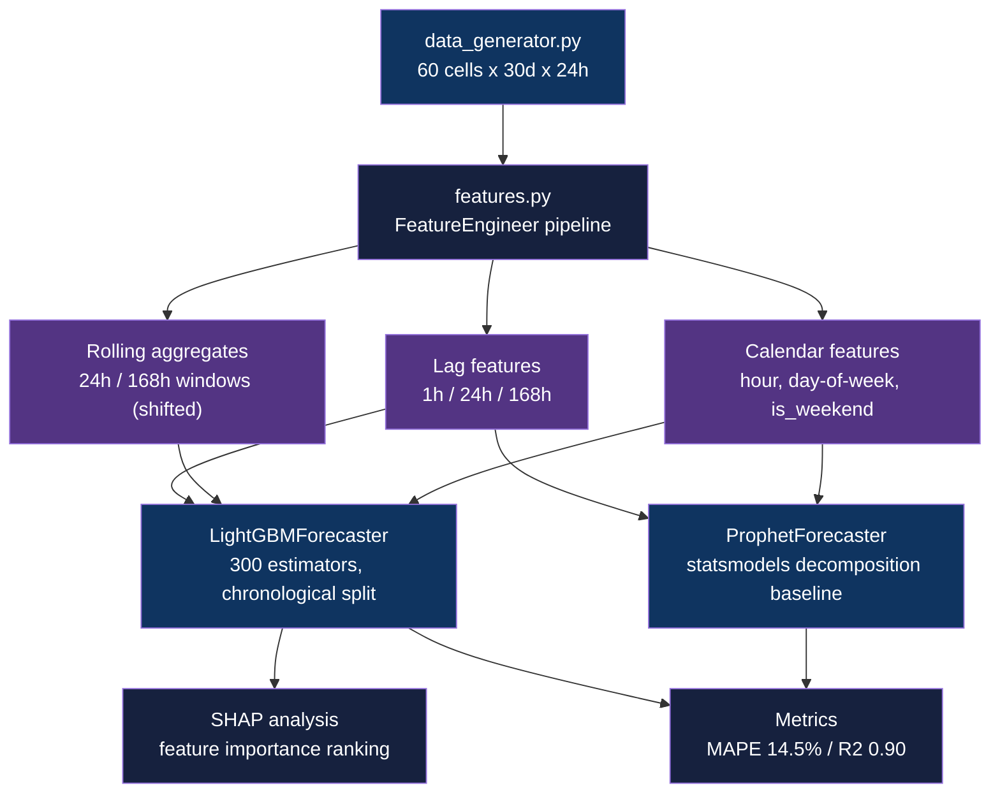

<div align="center">

# Telecom Capacity Forecasting

[](https://www.python.org/downloads/)
[](https://github.com/astral-sh/uv)
[](https://lightgbm.readthedocs.io/)
[](LICENSE)

**Forecast hourly cell-level network traffic load using LightGBM and statsmodels-based seasonal decomposition**

[Getting Started](#getting-started) | [Usage](#usage) | [Methodology](#methodology)

</div>

---

## Table of Contents

- [Features](#features)
- [Tech Stack](#tech-stack)
- [The Problem](#the-problem)
- [Architecture](#architecture)
- [Getting Started](#getting-started)
  - [Prerequisites](#prerequisites)
  - [Installation](#installation)
- [Usage](#usage)
- [Methodology](#methodology)
- [Results](#results)
- [Data Engineering](#data-engineering)
- [Project Structure](#project-structure)
- [Testing](#testing)
- [Related Projects](#related-projects)
- [License](#license)
- [Author](#author)

## The Problem

### Capacity Planning Under Traffic Uncertainty

Under-provisioned cells degrade quality of experience and drive churn; over-provisioning wastes CAPEX. Telecom operators need accurate short-horizon traffic forecasts to schedule just-in-time capacity upgrades at the individual cell level, where diurnal cycles, weekly seasonality, and sporadic event surges compound baseline growth trends.

### The Solution

LightGBM trained on lag features and leakage-free rolling aggregates captures the multi-scale temporal structure of per-cell traffic without relying on contemporaneous KPIs. A statsmodels seasonal decomposition provides an interpretable baseline and trend extrapolation for comparison.

## Features

- **Chronological train/test split** - preserves temporal order so the model is always evaluated on future data, not shuffled holdout
- **Leakage-free feature engineering** - rolling aggregates are shifted by one timestep before windowing, preventing any contemporaneous signal from leaking into training
- **SHAP interpretability** - tree SHAP values rank feature importance and expose which lag horizon drives each cell's forecasts
- **Synthetic data generator** - reproducible 60-cell x 30-day x 24h dataset with diurnal curves, weekly seasonality, growth trend, and event spikes
- **Dual-model comparison** - LightGBM regression vs statsmodels seasonal decomposition baseline for controlled model selection

## Tech Stack

| Component | Technology |
|-----------|------------|
| Language | Python 3.11+ |
| Primary model | LightGBM 4.1+ |
| Baseline model | statsmodels (seasonal decomposition + linear trend) |
| Interpretability | SHAP 0.42+ |
| Data | pandas, NumPy, pyarrow |
| Visualization | matplotlib, seaborn |
| Notebooks | Jupyter Lab |
| Package manager | uv |
| Testing | pytest, pytest-cov |

## Architecture



## Getting Started

### Prerequisites

- Python 3.11+
- [uv](https://github.com/astral-sh/uv) package manager

```bash
# Install uv if not already present
curl -LsSf https://astral.sh/uv/install.sh | sh
```

### Installation

1. Clone the repository:
   ```bash
   git clone https://github.com/adityonugrohoid/telecom-capacity-forecasting.git
   cd telecom-capacity-forecasting
   ```

2. Install dependencies:
   ```bash
   uv sync
   ```

## Usage

```bash
# 1. Generate synthetic dataset (creates data/raw/synthetic_data.parquet)
uv run python -m capacity_forecasting.data_generator

# 2. Run feature engineering pipeline (creates data/processed/engineered_features.parquet)
uv run python -m capacity_forecasting.features

# 3. Open the analysis notebook
uv run jupyter lab
# Navigate to notebooks/05_capacity_forecasting.ipynb

# Or execute the notebook non-interactively
uv run jupyter nbconvert --to notebook --execute notebooks/*.ipynb
```

## Methodology

### Problem Framing

| Attribute | Value |
|-----------|-------|
| Problem Type | Time-series regression |
| Target Variable | `traffic_load_gb` (per cell, per hour) |
| Primary Metric | MAPE |
| Key Challenge | Multiple seasonalities (24h diurnal + 7d weekly), 2%/month growth trend, per-cell variation, sporadic 2-3x event surges |

### Training Approach

| Parameter | Value |
|-----------|-------|
| Algorithm | LightGBMRegressor (num_leaves=63, n_estimators=300, lr=0.05) |
| Features | Lag features (1h, 24h, 168h), leakage-free rolling aggregates (24h, 168h), calendar features, interaction features |
| Validation | Chronological split (last 20% of rows as test; no shuffling) |
| Baseline | ProphetForecaster - statsmodels seasonal decomposition + linear trend extrapolation |

## Results

### Key Findings

| Metric | Score | Notes |
|--------|-------|-------|
| MAPE | 14.5% | Held-out chronological test set |
| R2 | 0.90 | Chronological split, no contemporaneous features |
| Peak-hour MAPE | 15.0% | 09:00-11:00 and 18:00-21:00 windows |
| Off-peak MAPE | 14.3% | Consistent accuracy across traffic regimes |

### Top Predictors

1. `traffic_load_gb_lag_1h` - most recent observation captures short-range autocorrelation
2. `traffic_load_gb_lag_24h` - same-hour-yesterday signal reflects the diurnal cycle
3. `traffic_load_gb_lag_168h` - same-hour-last-week captures weekly seasonality and growth
4. Lagged rolling aggregates (24h, 168h mean/std) - smooth noise and track trend direction

## Data Engineering

| Attribute | Value |
|-----------|-------|
| Data Source | Synthetic (reproducible, seed=42) |
| Records | 43,200 rows (60 cells x 30 days x 24h) |
| Features | 7 raw columns; lag, rolling, calendar, and interaction features added by `FeatureEngineer` |
| Domain Physics | Diurnal load curves with morning ramp and afternoon peak; weekday/weekend shape difference; 2%/month linear growth; ~2% of hours marked as events with 2-3x multiplier |

## Project Structure

```
telecom-capacity-forecasting/
├── pyproject.toml                 # uv project config and dependencies
├── notebooks/
│   └── 05_capacity_forecasting.ipynb   # End-to-end analysis notebook
├── src/
│   └── capacity_forecasting/
│       ├── config.py              # Paths and model/feature config constants
│       ├── data_generator.py      # Synthetic dataset generation
│       ├── features.py            # FeatureEngineer pipeline
│       └── models.py              # LightGBMForecaster + ProphetForecaster
├── data/
│   ├── raw/                       # Generated by data_generator (gitignored)
│   └── processed/                 # Generated by features.py (gitignored)
└── tests/
    └── test_data_quality.py       # Data integrity and generator tests
```

## Testing

```bash
# Run all tests
uv run pytest tests/ -v

# Run with coverage
uv run pytest tests/ -v --cov=src/capacity_forecasting
```

Tests cover data quality invariants (no missing values in critical columns, value ranges, categorical cardinality, growth trend presence) and generator reproducibility given the same seed.

## Related Projects

| Project | Description |
|---------|-------------|
| [telecom-ml-framework](https://github.com/adityonugrohoid/telecom-ml-framework) | Spec-first ML project templates and domain-informed data generators for 6 telecom use cases |
| [telecom-ml-portfolio](https://github.com/adityonugrohoid/telecom-ml-portfolio) | Index of 6 end-to-end telecom ML projects on synthetic network data |
| [telecom-churn-prediction](https://github.com/adityonugrohoid/telecom-churn-prediction) | Binary classification predicting subscriber churn (XGBoost, AUROC 0.86) |
| [telecom-root-cause-analysis](https://github.com/adityonugrohoid/telecom-root-cause-analysis) | Multi-class ranking of root causes in alarm cascades (XGBoost, Acc@1 0.91) |
| [telecom-anomaly-detection](https://github.com/adityonugrohoid/telecom-anomaly-detection) | Unsupervised cell-level anomaly detection on KPI time-series (Isolation Forest, F1 0.70) |
| [telecom-qoe-prediction](https://github.com/adityonugrohoid/telecom-qoe-prediction) | Session-level MOS regression from network KPIs (LightGBM, RMSE 0.45) |
| [telecom-network-optimization](https://github.com/adityonugrohoid/telecom-network-optimization) | RL-based RAN parameter tuning (Q-Learning, +61% vs random) |

## License

This project is licensed under the [MIT License](LICENSE).

## Author

**Adityo Nugroho** ([@adityonugrohoid](https://github.com/adityonugrohoid))
